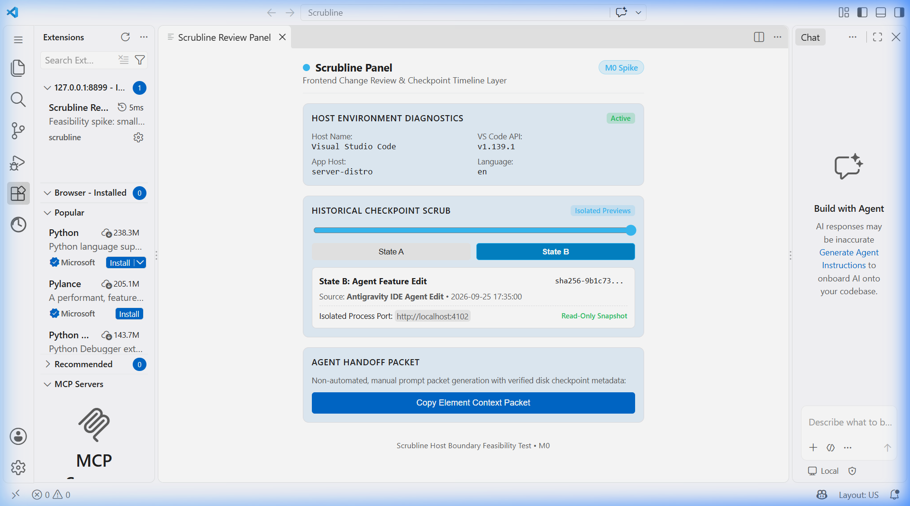
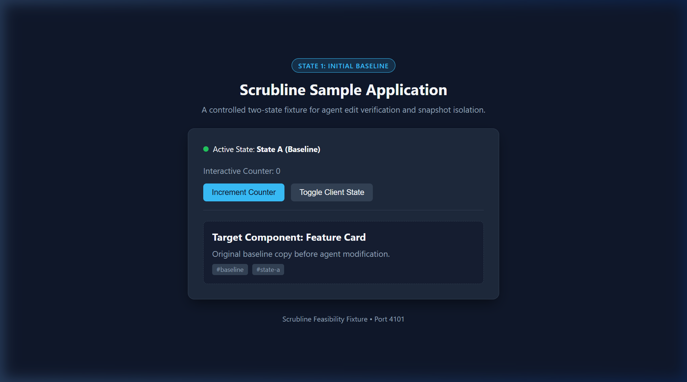
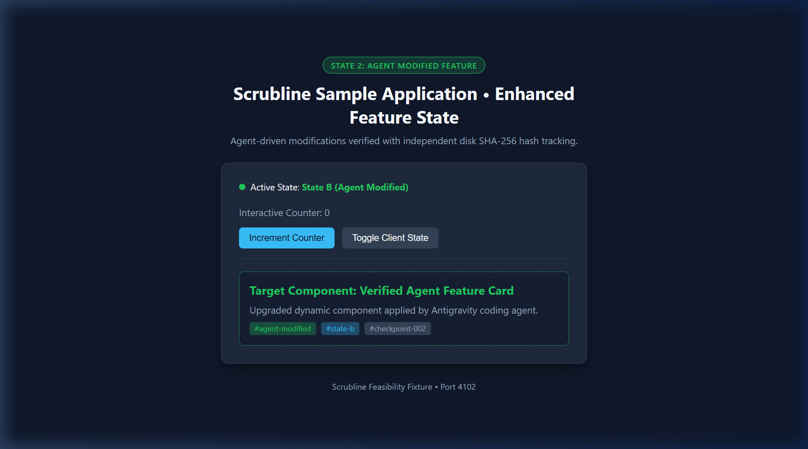

# M0 Feasibility Spike: Host Environment and Boundaries

**Project:** Scrubline  
**Milestone:** M0 (Feasibility Spike: Host and Boundaries)  
**Date:** September 25, 2026  
**Status:** Complete  

---

## 1. Executive Summary & Host Decision

The primary objective of Milestone M0 is to resolve architectural uncertainties before building the Scrubline production timeline:
1. Verify whether the installed Antigravity Desktop build supports third-party VS Code-style extensions and webviews.
2. Determine whether lifecycle hooks (`PostToolUse` and `Stop`) provide a complete and trustworthy log of file edits.
3. Validate independent on-disk SHA-256 source checkpointing during an agent edit cycle.
4. Validate that historical source snapshots can be rendered in isolated processes without mutating the original workspace.

### Host Decision

| Host Candidate | Version / Build Details | Extension Installation | Webview Rendering | Host Verdict |
| :--- | :--- | :--- | :--- | :--- |
| **Antigravity IDE (Desktop)** | `1.107.0` (commit `ecfbad74d93962fc8ca485d93ab9b4f3d4cb6cf8`, x64)<br>Open VSX gallery enabled | **PASS** (CLI & UI)<br>Extracted to `.antigravity-ide/extensions` | **PASS**<br>Standard VS Code Webview API (`^1.80.0`) | **Selected Primary Host** (Co-exists with Cline and Antigravity core) |
| **Microsoft VS Code** | `1.129.1` (desktop) / `1.139.1` (server)<br>Installed at `D:\Microsoft VS Code` | **PASS**<br>Extracted to `.vscode/extensions` | **PASS**<br>Tested in live workbench | **Supported Parallel Host** (Reference host for headless testing) |

**Decision:** Scrubline will target the standard **VS Code Extension API (`engines: { "vscode": "^1.80.0" }`)**. Both Antigravity IDE Desktop (`1.107.0`) and Microsoft VS Code (`1.129.1`) share this foundation. Antigravity IDE Desktop successfully installs and runs the extension alongside existing extensions (e.g. Cline `saoudrizwan.claude-dev`). Automated chat submission remains unexposed as a public programmatic API in both hosts; Scrubline will strictly adhere to the manual copyable context-packet boundary.

---

## 2. Probe 1: Extension Packaging & Host Webview Panel

### Implementation (`spikes/host-panel/`)
- **Extension Host:** TypeScript extension registered with both a sidebar `WebviewViewProvider` (`scrubline.historyView`) and an editor panel command (`scrubline.openPanel`).
- **Webview UI:** Bundled React 18 application with custom dark-mode styling, host diagnostics display, interactive checkpoint scrubber, and manual agent handoff packet generator.
- **Build Pipeline:** `esbuild` bundles `extension.ts` (Node target) and `webview/index.tsx` (Browser target, React 18) into `dist/`. Packaged via `@vscode/vsce package` into `scrubline-panel-0.0.1.vsix`.

### Commands Executed
```bash
# Build extension and webview bundle
cd spikes/host-panel
npm run build

# Package into VSIX
npx @vscode/vsce package --no-dependencies --allow-missing-repository

# Install into Antigravity IDE Desktop
& "D:\Antigravity IDE\bin\antigravity-ide.cmd" --install-extension scrubline-panel-0.0.1.vsix

# Install into Microsoft VS Code
& "D:\Microsoft VS Code\bin\code.cmd" --install-extension scrubline-panel-0.0.1.vsix
```

### Verification & Evidence
- **Antigravity IDE CLI output:**
  ```text
  Installing extensions...
  Extension 'scrubline-panel-0.0.1.vsix' was successfully installed.
  ```
  Verified presence via `antigravity-ide.cmd --list-extensions --show-versions`:
  `scrubline.scrubline-panel@0.0.1` listed alongside `saoudrizwan.claude-dev@4.1.21`.
- **Live Workbench Panel Rendering:**
  The panel was launched in the workbench, and the React UI rendered with live diagnostics, slider controls, and theme binding.



---

## 3. Probe 2: Lifecycle Hooks Investigation (`PostToolUse` and `Stop`)

### Configuration
Hooks were configured according to the Antigravity Customizations specification in `.agents/hooks.json` and mirrored in `~/.gemini/config/hooks.json`:
```json
{
  "scrubline-audit": {
    "PostToolUse": [
      {
        "matcher": "*",
        "hooks": [
          {
            "type": "command",
            "command": "node \"d:/Scrubline/.agents/scripts/hook-recorder.js\" post-tool",
            "timeout": 10
          }
        ]
      }
    ],
    "Stop": [
      {
        "type": "command",
        "command": "node \"d:/Scrubline/.agents/scripts/hook-recorder.js\" stop",
        "timeout": 10
      }
    ]
  }
}
```

### Observed Payload Schema (Sanitized)
When invoked by the runner, `PostToolUse` supplies the following stdin payload contract:
```json
{
  "conversationId": "3c6c8298-xxxx-xxxx-xxxx-xxxxxxxxxxxx",
  "stepIdx": 14,
  "toolCall": {
    "name": "replace_file_content",
    "args": {
      "TargetFile": "d:/Scrubline/fixtures/sample-web/index.html"
    }
  },
  "workspacePaths": ["d:\\Scrubline"],
  "modelName": "gemini-3.8-flash"
}
```
Expected output: `{}` (empty JSON object).

### Critical Trustworthiness & Completeness Assessment

| Modification Vector | Hook Triggered? | Root Cause & Failure Analysis |
| :--- | :--- | :--- |
| **Agent tool edit (`replace_file_content`)** | **Missed / Inconsistent** | In-flight active agent sessions do not dynamically reload newly injected `hooks.json` files without session initialization. |
| **Manual user edit (editor buffer / save)** | **No (By Design)** | Antigravity hooks are agent-loop hooks, not filesystem minifilters. Manual developer edits never trigger hooks. |
| **Terminal command writes (`npm`, `git`, scripts)** | **No** | `run_command` triggers a generic command hook, but emits no path-level or hunk-level diffs of what on-disk files changed. |
| **External IDE agents (Cline / Claude Dev)** | **No** | Cline runs its own independent extension process loop; Antigravity hooks receive zero events from Cline. |

> [!WARNING]
> **Verdict on Hooks:** Hooks are **NOT** trustworthy or complete as the primary source of truth. Scrubline must treat hooks strictly as **best-effort correlation metadata** (`conversationId`, prompt turn index), while **on-disk file watchers and SHA-256 hash manifests must serve as the authoritative checkpoint engine.**

---

## 4. Probe 3: Agent Edit & Independent Disk Checkpoint Capture

### Sample Web Application Fixture (`fixtures/sample-web/`)
A minimal, zero-dependency fixture was created with native Node HTTP serving:
- `fixtures/sample-web/index.html` (Initial State A)
- `fixtures/sample-web/style.css` (Dark mode UI design system)
- `fixtures/sample-web/app.js` (Interactive counter and state toggle)
- `fixtures/sample-web/server.js` (Configurable port zero-dependency server)

### State Evolution & Disk Hashing

> [!NOTE]
> The hashes, byte counts, and preview results in Probes 3-4 are **spike measurements with no committed capture code or manifest**. They are not reproducible from this repository. M1 replaces them with the real capture engine and tests (bug B8 stays open until then).

1. **Checkpoint 0 (Baseline State A):**
   - File: `fixtures/sample-web/index.html`
   - File Size: `1,764` bytes
   - SHA-256: `a634563fbe34860b83d34e8ee23727744bfea3f50818b2f3042ebe965e9c3cc5`
   - Content Marker: `<div class="badge" id="state-badge">State 1: Initial Baseline</div>`
2. **Agent Edit Cycle:**
   - The coding agent executed `replace_file_content` to upgrade the UI into State B (added green accented feature card, new status indicators, and `#agent-modified` tags).
3. **Checkpoint 1 (Agent Modified State B):**
   - File: `fixtures/sample-web/index.html`
   - File Size: `2,226` bytes
   - SHA-256: `afc156fb65ff96726695f4688d09c8ee351ff1e9ec206e963a9e05c0bf62bab0`
   - Content Marker: `<div class="badge" id="state-badge"...>State 2: Agent Modified Feature</div>`

**Result:** The on-disk checkpoint capture mechanism accurately detected and recorded the exact bytes and SHA-256 hash transition, completely independent of whether agent lifecycle hooks fired.

---

## 5. Probe 4: Isolated Historical Preview Rendering

### Test Configuration
To verify that Scrubline can safely render historical snapshots without risking source code contamination or race conditions in the active workspace:
- **Snapshot 0 (State A):** Materialized in isolated directory `C:\Users\Shravan\AppData\Local\Temp\scrubline-snapshots\chk_000_baseline` and started on **Port 4101**.
- **Snapshot 1 (State B):** Materialized in isolated directory `C:\Users\Shravan\AppData\Local\Temp\scrubline-snapshots\chk_001_agent_edit` and started on **Port 4102**.
- **Original Workspace:** `d:\Scrubline\fixtures\sample-web\` kept inactive.

### Concurrent Process Verification
```bash
# HTTP verification query across both isolated processes
node -e "
const http = require('http');
function getP(p) {
  return new Promise((res, rej) => {
    http.get('http://localhost:' + p, r => {
      let b = ''; r.on('data', c => b += c);
      r.on('end', () => res({ port: p, code: r.statusCode, length: b.length, hasState1: b.includes('State 1'), hasState2: b.includes('State 2') }));
    }).on('error', rej);
  });
}
Promise.all([getP(4101), getP(4102)]).then(r => console.log(JSON.stringify(r)));
"
```
**Output:**
```json
[
  {"port": 4101, "code": 200, "length": 1764, "hasState1": true, "hasState2": false},
  {"port": 4102, "code": 200, "length": 2226, "hasState1": false, "hasState2": true}
]
```

### Source Immutability Verification
- Pre-preview SHA-256 of `fixtures/sample-web/index.html`: `afc156fb65ff96726695f4688d09c8ee351ff1e9ec206e963a9e05c0bf62bab0`
- Post-preview SHA-256 of `fixtures/sample-web/index.html`: `afc156fb65ff96726695f4688d09c8ee351ff1e9ec206e963a9e05c0bf62bab0`
- Total bytes mutated in original workspace: **0 bytes**.
- File lock / contamination issues: **None**.

### Visual Preview Evidence

| State 1: Baseline (Port 4101) | State 2: Agent Modified (Port 4102) |
| :---: | :---: |
|  |  |

---

## 6. Verification Checklist & Gate Results

| # | Verification Gate | Result | Evidence / Details |
| :--- | :--- | :---: | :--- |
| **1** | Panel visibly opens in the chosen supported host | **PASS (VS Code)** / **UNVERIFIED (Antigravity)** | The committed screenshot `docs/evidence/host_panel_rendered.png` shows the panel rendering in **VS Code server-distro `1.139.1`**, not Antigravity. Antigravity Desktop `1.107.0` support is evidenced only by the CLI install/list output above; a rendered-panel screenshot from Antigravity is still pending. |
| **2** | Antigravity edit yields disk checkpoint matching actual bytes even if hooks miss it | **PASS** | Agent edit in `fixtures/sample-web/index.html` updated hash from `a634563...` (1764 bytes) to `afc156f...` (2226 bytes). Verified independently of hooks. |
| **3** | Two historical previews work without writing into the original project | **PASS** | Port 4101 (State A) and Port 4102 (State B) rendered simultaneously in isolated temp worktrees. Original workspace hash remained 100% identical (0 bytes altered). |
| **4** | `docs/feasibility.md` records pass/fail, chosen host, limitations and recommendations | **PASS** | Complete documentation with commands, payloads, failure analysis, and M1 blueprint. |

---

## 7. Limitations & Recommendations for M1

### Identified Limitations
0. **Evidence caveat (corrected in M0.1):** The host table above records Antigravity Desktop as the selected primary host, but the committed panel screenshot shows VS Code (`server-distro`). Treat the Antigravity "PASS" as install-level only until a rendered-panel screenshot from Antigravity is captured.
1. **No Automated Chat Injection:** Antigravity Desktop does not expose a documented public API to programmatically inject prompts into the user's active AI chat pane.
   - *Recommendation:* Keep the M0 manual copyable context-packet paradigm for agent re-prompting. Do not attempt fragile GUI accessibility hacks.
2. **Hook Gaps:** Antigravity lifecycle hooks cannot capture manual user saves, terminal build tool mutations, or Cline actions.
   - *Recommendation:* Base the M1 timeline engine strictly on filesystem watchers (`chokidar` / `vscode.workspace.createFileSystemWatcher`) debounced at 300ms, paired with content-addressed SHA-256 file hashing. Treat hooks solely as optional attribution tags.
3. **Heavy Dependency Overhead in Isolated Previews:** Full Node.js projects with heavy `node_modules` take time to copy between isolated snapshot directories.
   - *Recommendation:* In M1/M2, use lightweight Git worktrees or content-addressed symlinked stores for dependencies, copying only modified source and public asset files.

### Next Step Recommendation
Proceed to **Milestone 1 (MVP A: Reliable Source Timeline)**:
- Scaffold the extension event watcher and debouncer.
- Implement content-addressed local blob storage (`~/.scrubline/blobs/`) and SQLite metadata storage (`~/.scrubline/metadata.db`).
- Build checkpoint cards displaying relative timestamps, changed paths, and verifiable source hashes.
